# ReconFLOW

Invoice-to-payment reconciliation with an exception queue, maker-checker approval and an
immutable audit trail. The interesting part is not the CRUD: it is the matching logic, the
exception taxonomy, and how the system behaves when the input is messy.

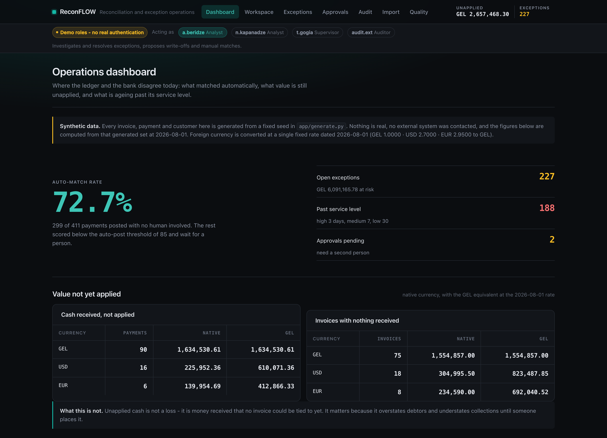

## What it does

- Ingests invoice and bank-payment CSVs defensively: content-hashed for idempotency,
  tolerant of reordered and oddly spelled columns, parses both `1234.56` and `1.234,56`,
  and rejects a bad row with a reason instead of failing the whole file.
- Reads the formats banks actually send: SWIFT **MT940** and ISO 20022 **CAMT.053**,
  recognised by content rather than file extension, and routed through that same
  validation so a statement line is rejected with a reason like any other row.
- Matches payments to invoices in two passes: five deterministic rules first, then a
  weighted probabilistic score for the remainder, including one-payment-to-many-invoices
  and many-payments-to-one-invoice groupings.
- Explains every automated decision. Each scored match renders a per-component breakdown
  in plain language: "reference differs by one character", "amount differs by GEL 0.02",
  "paid 8 days after the invoice".
- Routes what it cannot settle into a typed exception queue with nine reason codes, each
  carrying severity, value at risk in GEL, ageing bucket, owner and an SLA clock.
- Puts value movements through maker-checker approval, refuses self-approval in the domain
  layer, enforces read-only roles server-side, and writes an append-only audit row on every
  state transition.

On the bundled dataset it matches **72.7% of payments automatically** (299 of 411) and
raises **227 exceptions**. Those numbers are computed by the code at seed time, not quoted
from anywhere.

## Why it exists

I have done accounts-receivable work: reviewing invoices, tracking payments, chasing the
differences. The job is mostly not arithmetic. It is deciding whether the customer who paid
GEL 4,912.00 against a GEL 5,000.00 invoice took an unagreed discount, paid the wrong
invoice, or is one of three customers who all owe roughly that much. This project is that
job, engineered: the question it answers is *how much of it can be automated safely, and
what does the system have to prove before a machine is allowed to post a payment?*

The answer it implements: a payment is never posted on an amount coincidence alone. With no
usable remittance reference, the scorer can reach at most 60 of 100 (amount 30 + date 20 +
customer 10), which is below the auto-post threshold of 85 by construction.

## Run it

Requires Python 3.12.

```bash
./run.sh
# then open http://127.0.0.1:8012
```

`run.sh` creates the virtualenv if missing, seeds deterministically (same data every run,
no duplicate rows on a second run), regenerates the test-evidence report, and starts
uvicorn on port 8012.

## What to look at first

Five minutes, in this order:

1. **http://127.0.0.1:8012/** — the dashboard. Auto-match rate, unapplied value by
   currency, exceptions by reason, ageing, SLA breaches. Note the synthetic-data warning
   and the caveat explaining why nearly everything is breaching SLA on a first run.
2. **http://127.0.0.1:8012/workspace?status=proposed** — the 30 matches the engine would
   not post. Each row draws its confidence against the auto-post threshold, so a column of
   bars all stopping just short of the same line is the whole argument in one glance.

   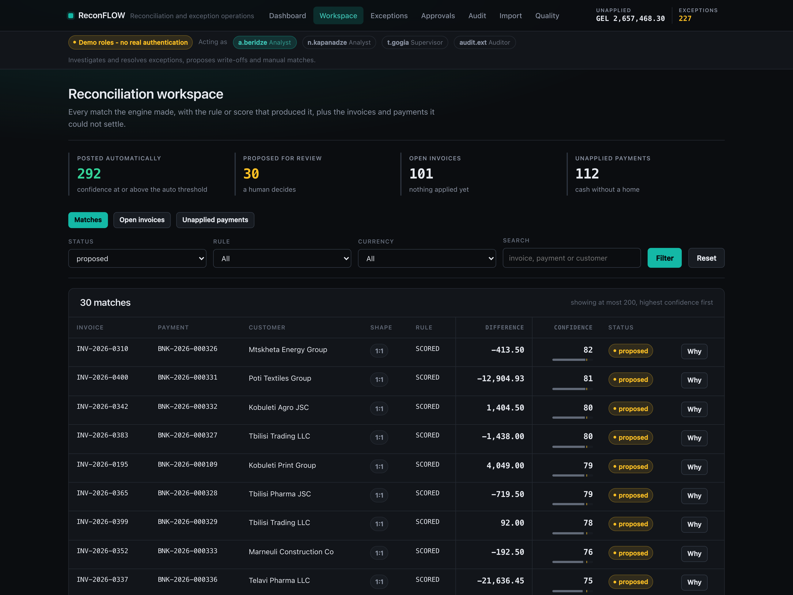

   *Scores in the high seventies and low eighties, every one of them short of 85. The engine
   found a credible candidate and still refused to post it.*

   Then **http://127.0.0.1:8012/workspace/match/194** — a scored match. The confidence is
   not a number the system asks you to trust: it is the sum of four weighted components,
   each with the sentence explaining what it measured.

   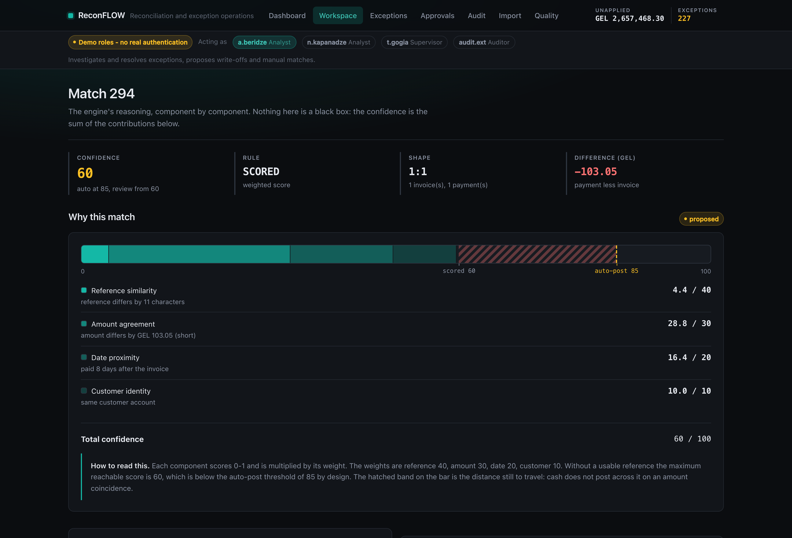

   *A match scoring 60. The bar is the score; the dashed line is the auto-post threshold of
   85. The hatched band is the distance the evidence does not cover, so this payment waits
   for a person.*

3. **http://127.0.0.1:8012/exceptions?severity=high** — the queue filtered to high
   severity. Open any item: it states what happened, what it means, and what to do.

   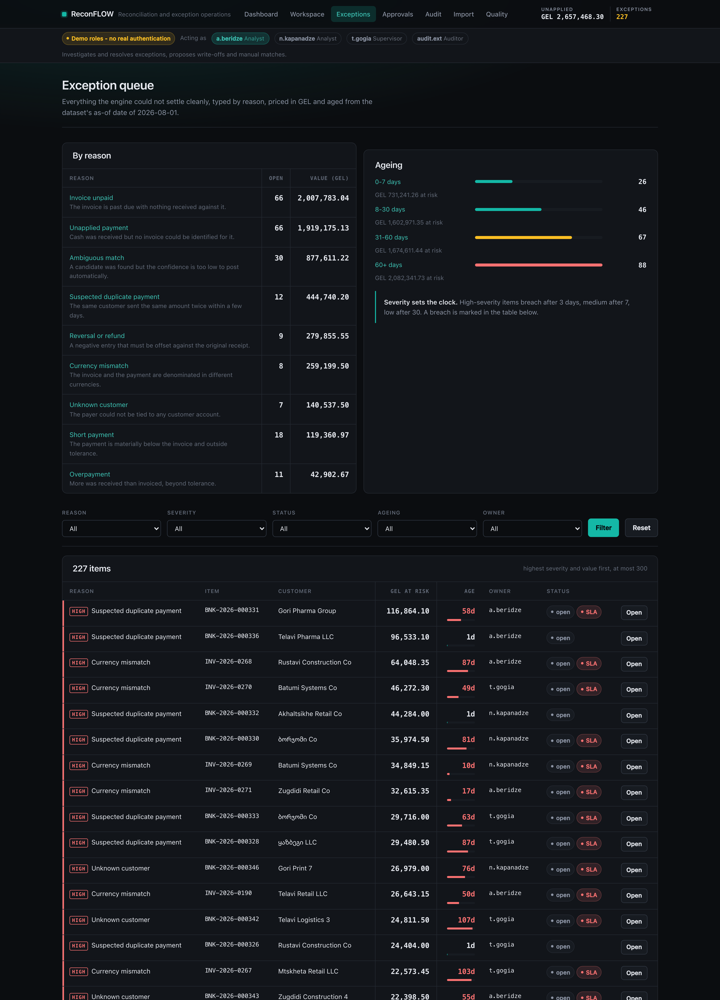

   *Severity leads each row as a rule and a tag; age is a length, not just a number.*

   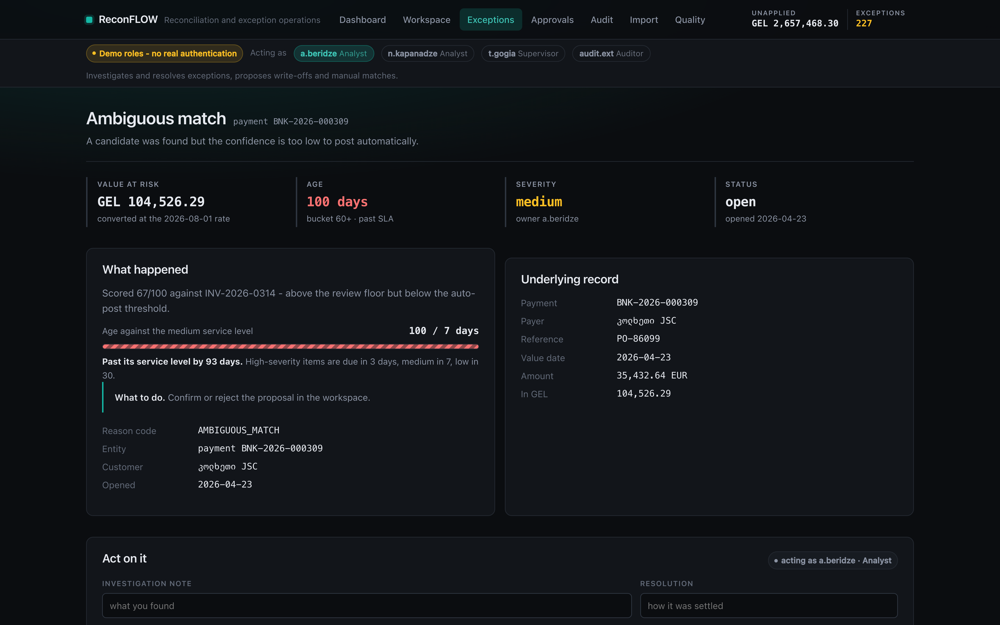

   *On the detail page the SLA clock is drawn against the limit for that severity, hatched
   when breached so it survives greyscale, with the overrun stated in days.*

4. **http://127.0.0.1:8012/approvals** — switch to `t.gogia` in the demo role bar and try
   to approve the item `t.gogia` raised. The server refuses it. Then approve the item
   `n.kapanadze` raised, which works. Try either as `audit.ext` and it is refused for a
   different reason.

   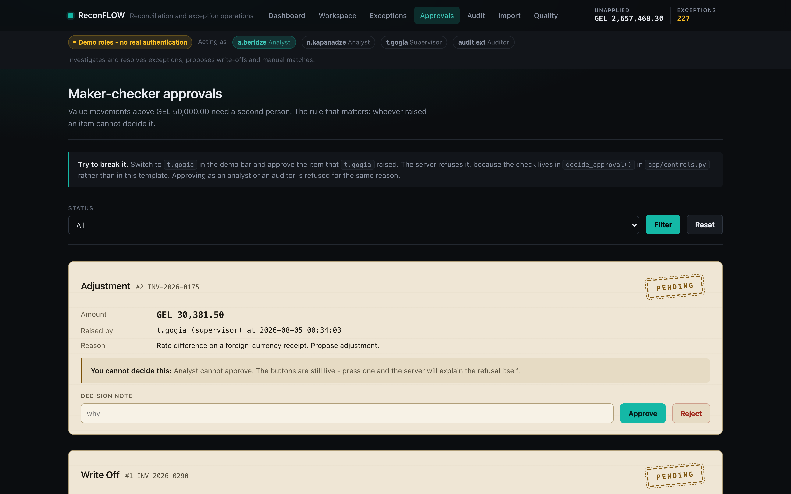

   *Approvals are records, so they sit on paper and carry a stamp. The state is in the word
   and the frame, not only in the colour.*

   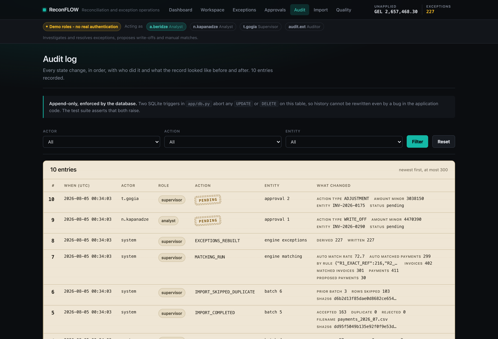

   *The same stamp in the audit log at **/audit**, which SQLite triggers make append-only.*

5. **http://127.0.0.1:8012/import** — batch history. One batch is the same file imported
   twice: 103 rows seen, 0 accepted, 103 skipped. The rejected-row report shows the eight
   malformed rows planted in the generated files and why each was refused. Upload
   `data/samples/statement_mt940.sta` (or the CAMT.053 equivalent beside it, which carries
   the same eight receipts) and re-run matching to watch the rate move.

   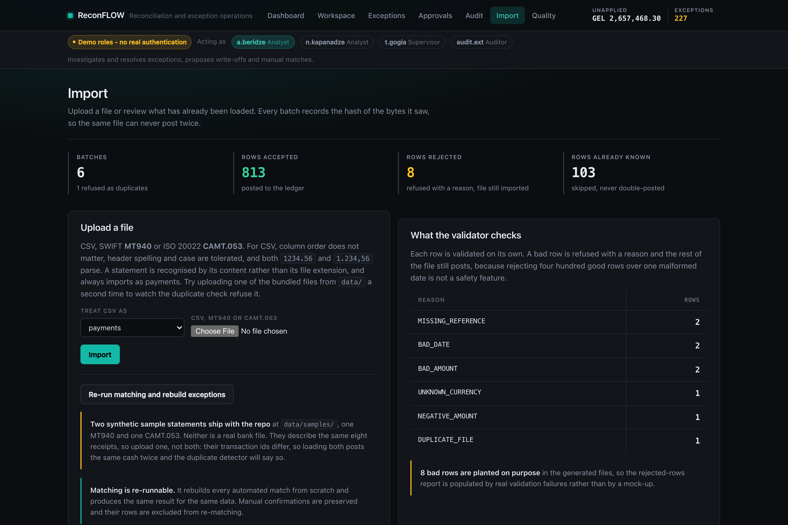

   *The same batch, hash and rejected-row machinery handles all three formats.*

Then **http://127.0.0.1:8012/quality** for the test evidence, written by the test run
itself rather than by hand: six areas, what each protects, and the pass counts that came
out of the run.

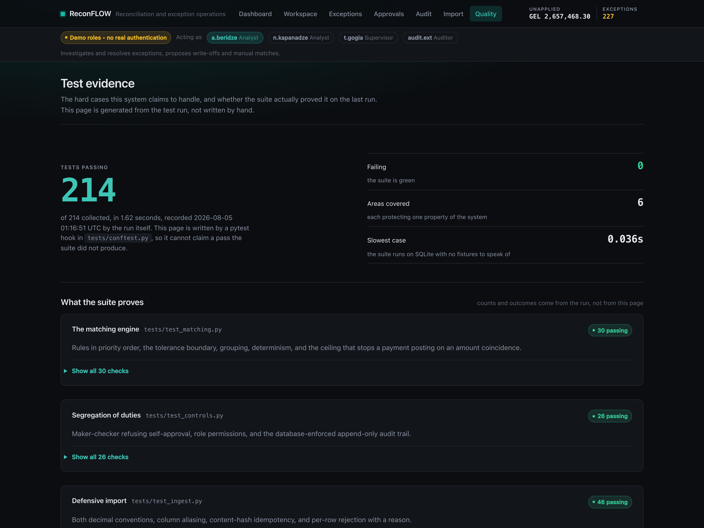

*Nothing on that page is typed by hand except the sentence describing each area. The counts
and outcomes come from a pytest hook.*

It holds at a phone width — every page is checked at 375px for horizontal overflow, and
wide tables scroll inside their own container rather than the page:

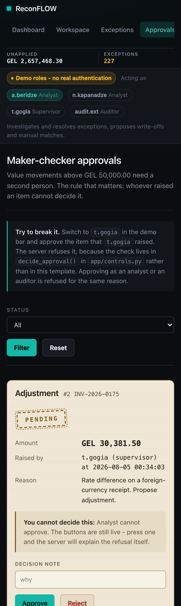
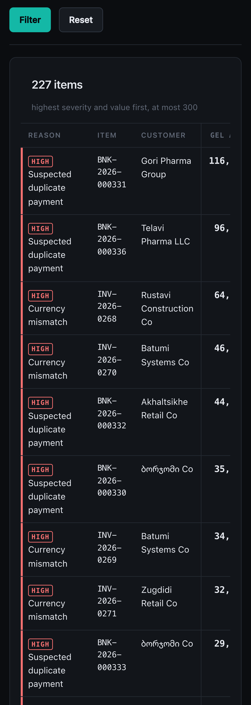

## How it works

```
data/*.csv ──► ingest.py ──► SQLite ──► matching.py ──► exceptions.py ──► reporting.py ──► main.py
              sha256 gate            pass 1: R1..R4      9 reason codes     aggregations    routes
              per-row validation     pass 2: scoring     ageing + SLA                       (thin)
              FX normalisation       explainable                │
                    │                      │                    │
                    └──────────────────────┴────────────────────┴──► controls.py
                                                                     RBAC · maker-checker
                                                                     append-only audit_log
```

Every module is importable and unit-testable; route handlers only gather and render. Money
is stored as integer minor units throughout — never floats — because the matching tolerance
is "exactly 0.02" and a float turns that boundary into a coin toss.

Matching is a pure function. `match(invoices, payments, cfg)` touches no database, no clock
and no global state, so the same inputs always produce byte-identical output;
`run_matching()` is the thin persistence wrapper around it.

## Engineering notes

- **Idempotency is at two levels.** A file is identified by the sha256 of its bytes, so a
  bank re-sending yesterday's file posts nothing and is recorded as a duplicate batch. A
  row is separately identified by its invoice number or bank transaction id, so a file that
  merely overlaps with a previous one imports only the genuinely new rows.
- **Reference matching uses containment, not equality.** `PMT-INV-2026-0143 PAYMENT`
  resolves to `INV-2026-0143` after normalisation, with a minimum fragment length so short
  numbers do not match by accident. Typos fall through to pass 2, where a
  `difflib.SequenceMatcher` ratio plus the other components usually still clears the auto
  threshold — which is the case for the Georgian-script references in the dataset.
- **The tolerance is the larger of a flat 0.02 and 0.5%.** On a GEL 1.00 invoice the flat
  allowance binds; on a GEL 10,000.00 invoice the percentage does. Both boundaries are
  tested at the exact edge, inclusive.
- **Self-approval is refused in `decide_approval()`, not in the template.** Hiding a button
  is usability; it is not a control. The approvals page deliberately leaves the buttons live
  when you are not allowed to press them, so the refusal comes from the server and you can
  see it happen.
- **The audit log is append-only at the database level.** Two SQLite triggers abort any
  `UPDATE` or `DELETE`, so a bug in the application cannot rewrite history. The tests assert
  that both raise.
- **Currency mismatch short-circuits the difference check.** An invoice in USD paid in GEL
  would otherwise report a huge "short payment"; it is typed as `CURRENCY_MISMATCH` instead,
  which is the actual problem.
- **Ageing is measured from a fixed as-of date** (`generate.AS_OF`), not `date.today()`.
  Otherwise the buckets drift daily and no test could assert on them.
- **Duplicate detection only flags unsettled cash.** Two equal payments that both found a
  home are an instalment plan. This was a real bug caught by comparing planted counts
  against detected counts: the generator's own instalment pairs were being reported as
  duplicate payments.

## Tests

```bash
./.venv/bin/python -m pytest -q
```

**214 tests, all passing.** They import the domain modules directly rather than driving the
UI, which is what makes them meaningful. Coverage of the awkward cases:

- **Statements** — MT940 and CAMT.053 fixtures describing the same ten transactions, parsed
  and compared row for row; a `D` mark and a `DBIT` indicator both arriving negative;
  continuation lines folded into their tag; format detected from content rather than file
  extension; an unparseable statement line skipped without failing the file.
- **Import** — same file twice posts nothing; comma-decimal and thousands-separator
  parsing; reordered columns and header noise; bad date, negative amount, missing
  reference and unknown currency each rejected individually while the rest of the file
  imports; a missing required column rejects the file with the column named; row-level
  duplicate keys skipped; auditor refused.
- **Matching** — each rule in isolation; tolerance boundary exactly at the limit for both
  the absolute and percentage rules; breakdown contributions summing to the confidence;
  one-to-many and many-to-one grouping; determinism across repeated runs; no invoice or
  payment assigned twice; the structural guarantee that an unusable reference cannot reach
  the auto threshold; manual confirmations surviving a re-match.
- **Exceptions** — every reason code detected on a crafted fixture; ageing bucket edges;
  SLA thresholds per severity; currency mismatch suppressing a misleading short-pay; the
  instalment-versus-duplicate distinction; resolution requiring a reason; resolved items
  not reopening.
- **Controls** — self-approval refused for both approve and reject; wrong role refused;
  already-decided items refused; threshold boundary; audit written on every transition and
  *not* written when an action was refused; `UPDATE` and `DELETE` on `audit_log` raising.
- **Web** — every route returns 200 with a heading, a lede and a mobile viewport; refusals
  driven through the real HTTP forms; errors rendered in the page shell with their real
  status code; every page checked against an empty database, which is how the NULL-sum bug
  in the import-health query was found.

Deliberately not covered: CSS rendering, browser behaviour, and concurrent writes (SQLite
is opened per request and the demo is single-user).

## Limitations

- **The data is synthetic.** It is generated from a fixed seed by `app/generate.py`. No real
  customer, invoice or bank record is present, and the UI says so on every page.
- **FX is a single fixed snapshot**, not a dated rate curve. Every conversion uses the rate
  labelled 2026-08-01. Real reconciliation needs the rate on the value date of each receipt.
- **There is no authentication.** The role switcher in the top bar is a demo affordance and
  is labelled as one. Authorisation is enforced server-side, but identity is a cookie anyone
  can set.
- **Statement support is the common subset.** MT940 tags 20/25/28C/60F/61/86/62F and the
  CAMT.053 entry fields a receipt needs. Structured `:86:` sub-fields beyond `ORDP` and
  `REMI` are read as free text, and no balance reconciliation is performed against the
  opening and closing balances the statement carries.
- **Grouping is bounded at three members per side** and searches combinations exhaustively.
  It is correct for the demo's scale and would need a smarter search for a large ledger.
- **The date convention is assumed day-first.** An ambiguous `03/04/2026` is read as 3 April.
  A real importer would take the convention per source rather than guessing.
- **SLA breach counts look alarming on a first run** because the dataset is four months of
  history nobody has worked. That is explained in the UI rather than hidden by tuning the
  data.
- **Single-user assumptions.** No locking, no optimistic concurrency; two people resolving
  the same exception simultaneously is not handled.
